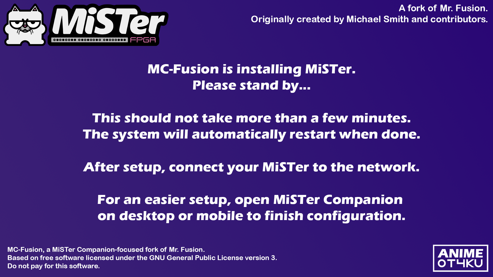

# MC-Fusion

MC-Fusion is a MiSTer Companion focused fork of the original [Mr. Fusion](https://github.com/MiSTer-devel/mr-fusion) installer.

MC-Fusion is a small flashable SD card image that installs a basic MiSTer setup on a DE10-Nano / MiSTer FPGA. After installation, the SD card is expanded to its full size and prepared for use with MiSTer Companion.

MC-Fusion keeps the original Mr. Fusion installation but adds Companion focused extras.

## Included extras

- MiSTer Companion Daemon
- Update All script
- WiFi setup script
- Custom wallpaper
- Samba enabled on first boot, active after reboot
- Auto-Time Script
- Static Wallpaper Script
- CD Game Organizer Script
- MiSTer.ini, updated with the latest compatible changes 
- MiSTer Companion Remote prepared automatically on first boot

## Requirements

- DE10-Nano / MiSTer FPGA setup
- Micro SD card, 2 GB or larger
- Windows, macOS, or Linux computer
- MiSTer Companion or another SD card flashing tool

## Installation with MiSTer Companion

MiSTer Companion includes MC-Fusion as a built-in flashing option.

1. Open MiSTer Companion.
2. Go to the Flash SD tab.
3. Select MC-Fusion.
4. Select your SD card.
5. Start the flash process.
6. Insert the SD card into your DE10-Nano and power it on.

MC-Fusion will automatically repartition the SD card, install MiSTer, copy the included scripts, and reboot when done.

After setup, connect your MiSTer to the network and open MiSTer Companion on desktop, Android, Switch, or Vita to continue setup and manage your device.

## Manual installation

1. Download the latest MC-Fusion image from the releases page.
2. Extract the `.img` file if your flashing tool does not support zipped images.
3. Flash the image to your SD card with a tool such as:
   - balenaEtcher
   - Win32 Disk Imager
   - Apple Pi Baker
   - dd
4. Insert the SD card into your DE10-Nano.
5. Power on the MiSTer and wait for the installation to finish.

## Installer screen

During installation, MC-Fusion shows the following splash screen:



## Notes

MC-Fusion installs a custom wallpaper as:

```text
/media/fat/menu.png
```

The first boot setup also attempts to enable the menu background automatically.

Samba is enabled on first boot by renaming:

```text
/media/fat/linux/_samba.sh
```

to:

```text
/media/fat/linux/samba.sh
```

## Building it yourself

MC-Fusion can be built with Docker.

### Build the Docker image

```sh
docker build -t mc-fusion .
```

### Create the MC-Fusion SD card image

See the MiSTer SD Installer repository for available MiSTer release files:

```text
https://github.com/MiSTer-devel/SD-Installer-Win64_MiSTer
```

Then run:

```sh
docker run --rm --privileged \
  -e MISTER_RELEASE="release_20231108.7z" \
  -v "$PWD":/files \
  mc-fusion
```

The finished image will be created in:

```text
./images
```

## Original project

MC-Fusion is based on the original Mr. Fusion project:

```text
https://github.com/MiSTer-devel/mr-fusion
```

Mr. Fusion was originally created by Michael Smith and contributors.

## Disclaimer

This project is free software and comes without warranty. See the included license file for details.